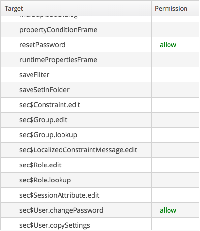

[](http://www.apache.org/licenses/LICENSE-2.0)
[](http://semver.org/spec/v2.0.0.html)
[][2]
[][1]

# CUBA Forgot Password Component

This application component gives the following features once added to a CUBA project:

- Enables displaying an optional _Forgot password_ link in the main login window, allowing users to send 
themselves an email with a reset password link
- Enables logging in by both login name and email (this works also when using REST API). **PLEASE NOTE**
that requires a `UNIQUE` constraint on the `email` attribute of the `User` entity (simply put, users'
emails must be unique in the system)
- Exposes a new REST service (_extsec_UserManagementService_) that enables REST clients to use the
forgot password functionality via API calls


## Installation

**NOTE**: This add-on's repository is officially linked to the main CUBA repository.

*You can jump straight to step 2. for instructions on how to add it to your project*, or *optionally*
you can choose to add my repository to your project's repositories.  

1. [*OPTIONAL*] Add the following maven repository `https://dl.bintray.com/pfurini/cuba-components` to the build.gradle of your CUBA application:

```
buildscript {
    
    //...
    
    repositories {
    
        // ...
    
        maven {
            url  "https://dl.bintray.com/pfurini/cuba-components"
        }
    }
    
    // ...
}
```

Alternatively you can use **CUBA Studio** to add it: just go to the `PROJECT PROPERTIES` section,
click `Edit`, then click on the cog icon next to the `Repository` field.
In the dialog that opens, click on `+ Add` and enter `https://dl.bintray.com/pfurini/cuba-components`
in the `URL` field, then click `OK`. Finally, select the just added repository in the upper list,
and click `Use in the project` button, and then press `OK`.

2. Select a version of the add-on which is compatible with the platform version used in your project:

| Platform Version | Add-on Version | Coordinates
| ---------------- | -------------- | -----------
| 6.6.*            | 0.1.1          | it.nexbit.cuba.security.forgotpassword:nxsecfp-global:0.1.1
| 6.7.*            | *N/A*          | *not compatible*
| 6.8.*            | 0.2.0          | it.nexbit.cuba.security.forgotpassword:nxsecfp-global:0.2.0
| 6.9.*            | 1.0.0          | it.nexbit.cuba.security.forgotpassword:nxsecfp-global:1.0.0
| 6.10.*           | 2.2.0          | it.nexbit.cuba.security.forgotpassword:nxsecfp-global:2.2.0

The latest stable version is: `2.2.0`

Add custom application component to your project. Using **CUBA Studio**, go to `PROJECT PROPERTIES` -> `Edit` and click `+` next to `Custom components`,
then paste into the first field the appropriate coordinates for the desired version, picked from the table above.

**PLEASE NOTE** that new features are developed only in the latest releases, while only critical bug fixes
are back-ported to older ones. Please update your CUBA version as soon as possible, if you are in need of
some features available only in a recent release (see the [CHANGELOG](./CHANGELOG.md) for reference).

#### BREAKING CHANGE NOTICES

**1.0.0**
- The `loginWindow` screen has been refactored a bit. You need to change your code if you have extended this screen, otherwise no action is required.
- CUBA 6.9 makes the `Anonymous` role a *Denying* role by default. So **if you install the component in a brand new project, it will not work until you adjust the permissions for the `Anonymous` role**.
No action is required if upgrading an existing project, or your `Anonymous` role is already configured with the needed roles.
Please see the paragraph *Setup the Anonymous role* in the *Usage* section, for instructions on how to setup a new CUBA 6.9 project.
 
**2.0.0**
- The `loginWindow` screen has been refactored to follow the changes made in CUBA 6.10 for the new *Hover* theme. You need to change your code if you have extended this screen, otherwise no action is required.
- The extended `allowAnonymous` attribute in _rest-services.xml_ file has been removed. Please use the `anonymousAllowed` standard attribute introduced in CUBA 6.10 instead.
  Remember to change the attribute `xmlns="http://schemas.haulmont.com/cuba/rest-services-v2-ext.xsd"` in your _rest-services.xml_ to the standard `xmlns="http://schemas.haulmont.com/cuba/rest-services-v2.xsd"` one.


## Supported DBMS engines

Since version 0.2.0 this plugin supports the following RDBMS engines:

- HSQLDB
- PostgreSQL
- MySQL/MariaDB 10.x (thanks to Mario David)
- Microsoft SQL Server (tested against *2017-GA Express* on Ubuntu 16.04)
- Oracle 11g+ (tested against *Oracle Express Edition 11g*)

## Created tables

| Table Name | Scope |
| ---------- | ----- |
| NXSECFP_RESET_PASSWORD_TOKEN | Holds generated reset tokens, alongside the linked User entity and timestamp of expiration |

## Usage

### Setup the Anonymous role (1.0.0+ only)

If you install the `1.0.0` or later add-on version on a brand new CUBA project, please follow these instructions to setup your `Anonymous` role.

1. Login as `Administrator`
1. Open the `Roles` screen in the `Administration` menu
1. Find the `Anonymous` role and edit it
1. In the `Screens` tab expand the `Other screens` target, then find the screens listed in the following image, and set them to `allow`


1. Finally `Save and Close` the edit screen, and restart the application 


### Using the Forgot Password functionality

To enable the Forgot password link, and related functionality in the main login window, follow these steps:

1. Add the following properties to your `web-app.properties` file:
```properties
# this property enables the reset password link in login window
ext.security.showResetPasswordLinkAtLogin = true

# you must include the "reset" link handler action to be able to open the change pass dialog via custom link
cuba.web.linkHandlerActions = open|o|reset
```

2. Optionally, create custom reset link emails and set the corresponding paths in your `app.properties` file,
located in the `core` module:
```properties
# create customized email templates, and set the full path in these properties
ext.security.resetPasswordLinkTemplateBody = /it/nexbit/cuba/security/forgotpassword/app/email/reset-password-link-body.gsp
ext.security.resetPasswordLinkTemplateSubject = /it/nexbit/cuba/security/forgotpassword/app/email/reset-password-link-subject.gsp
```
You can find built-in templates here: [Default email templates](https://github.com/pfurini/cuba-component-forgot-password/tree/master/modules/global/src/it/nexbit/cuba/security/forgotpassword/app/email).
Remember that they use the same mechanism described here in the official docs: https://doc.cuba-platform.com/manual-6.8/users.html, so
they can be localized adding a locale suffix, and they can also be located or overridden in the tomcat configuration directory, with 
the properties added to the `local.app.properties` file.

#### Properties
The component also exposes the following DATABASE properties, that you can configure in your running app:

| Property                                       | Default Value                       | Description                                              |
| ---------------------------------------------- | ----------------------------------- | -------------------------------------------------------- |
| ext.security.resetPasswordLinkWebPath          | /reset                              | The path appended to your web application URL when the token is generated from the standard login window (**WARNING**: do not modify this value unless you are extending or changing the component behavior) |
| ext.security.resetPasswordLinkPortalUrl        | http://localhost:8080/portal/reset  | You **should** change this property if you plan to use the forgot password functionality from REST clients. This endpoint must be configured using your JS framework of choice, and it is beyond the scope of this documentation |
| ext.security.resetPasswordTokenLifetimeMinutes | 1440                                | The lifetime of a newly generated reset token (default 24 hours) |

#### extsec_UserManagementService Methods

The following are the methods exposed by the `extsec_UserManagementService`

```xml
<?xml version="1.0" encoding="UTF-8"?>
<services xmlns="http://schemas.haulmont.com/cuba/rest-services-v2-ext.xsd">
    <service name="extsec_UserManagementService">
        <method name="checkUserExist" anonymousAllowed="true">
            <param name="loginOrEmail"/>
        </method>
        <method name="sendResetPasswordLink" anonymousAllowed="true">
            <param name="loginOrEmail"/>
        </method>
        <method name="checkResetPasswordToken" anonymousAllowed="true">
            <param name="token"/>
        </method>
        <method name="changePasswordWithToken" anonymousAllowed="true">
            <param name="token"/>
            <param name="password"/>
        </method>
        <method name="deleteResetPasswordToken" anonymousAllowed="true">
            <param name="token"/>
        </method>
    </service>
</services>
```

Consult the online documentation at [this link][2],
or the JavaDoc documentation on the interface methods for explanation of their usage and parameters.

You can use the following button to open a collection of requests in the [Postman](https://www.getpostman.com/) application:

[][1]

#### Usage Notes

The methods exposed to REST clients are not all the methods available on the `NexbitUserManagementService` interface,
but only the _safest_ ones.

Feel free to use the other ones in your own client and middleware code, for example if you want to implement
a new management functionality to bulk send reset passwords to a group of users.

This is specially useful, because the methods on that interface allow to explicitly set the `baseUrl` to use when
generating reset links, and so you could let your power user (admin) to choose where end users will be redirected
when clicking the link (if you have multiple apps for multiple groups of users).

In this regard, the component use a couple of defaults when choosing which `baseUrl` to use when generating reset links:

- if the user click the _Forgot password_ link on the main (vaadin) login window, it will use the URL obtained by
concatenating the values from `GlobalConfig#getWebAppUrl()` and the `ext.security.resetPasswordLinkWebPath` property
- if the request comes from the `sendResetPasswordLink` REST service method, it will use the URL in the `ext.security.resetPasswordLinkPortalUrl`
property

In both cases, it will append a `token=<TOKEN_VALUE>` query string to the final URL.

## Known Issues

See the corresponding issue to find if a workaround is currently available.

## Credits

Thanks to

- Mario David ([@mariodavid](https://github.com/mariodavid)) for the initial MySQL/MariaDB scripts
- Sorin Federiga ([@sorinfederiga](https://github.com/sorinfederiga)) for the Romanian translation
- Sergey Butentin ([@basicus](https://github.com/basicus)) for the Russian translation
 

[1]: https://app.getpostman.com/run-collection/f7b921d260a173059894#?env%5Bsec-forgot-password%20TEST%5D=W3sia2V5IjoiYmFzZXVybCIsInZhbHVlIjoiaHR0cDovL2xvY2FsaG9zdDo4MDgwL2FwcC9yZXN0IiwiZW5hYmxlZCI6dHJ1ZSwidHlwZSI6InRleHQifV0=
[2]: https://documenter.getpostman.com/view/48162/sec-forgot-password-cuba/RW1Vr2Zh